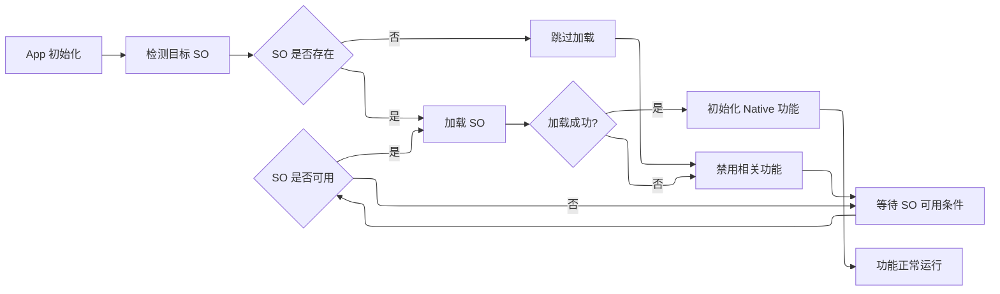
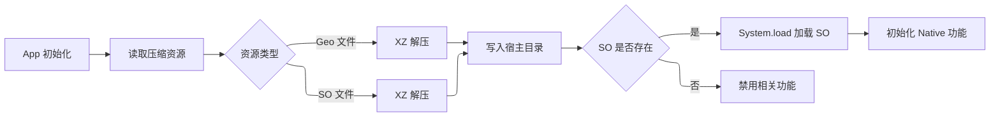
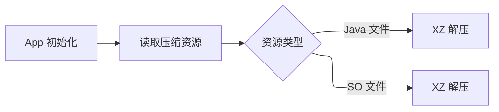

之前没太深入了解过 Android 的一些机制，所以并不清楚这些内容

# 问题引入

之前在 Android 端 App 开发中集成 [Sub-Store](https://github.com/sub-store-org/Sub-Store) 学习了 SubCase 这样的一个做法，后端是由 [Javet](https://github.com/caoccao/Javet)驱动的这么一个方法

<GitHub.Repo repo="sionnx/SubCase" />


Release 打包之后的 Apk 大小居然有 80M，这还是不算其他的，仅仅是 Sub-Store 这么一个 feature 引入大小体积就变化这么大，解包之后发现绝大多数体积都来自 Javet 这么一个库，而且发现并未启用旧版打包方式来压缩体积，衡量一下对比发现，在省流量和省体积之间选择前者收益应该是高一点的，然后就发了一个 PR  [https://github.com/sionnx/SubCase/pull/4](https://github.com/sionnx/SubCase/pull/4)

```kotlin
// https://developer.android.com/reference/tools/gradle-api/8.0/com/android/build/api/dsl/JniLibsPackagingOptions#useLegacyPackaging()

// var useLegacyPackaging: Boolean?

useLegacyPackaging = true
```

启用之后看起来打包体积优化收益还是挺高的，**82MB → 22 MB** ，但是对在 YumeBox 中已经打包 Mihomo 作为内核情况下体积还是有一些大。
作为扩展性 feature 可选性比较重要，并不需要强制打包在内，需要时扩展下载即可，例如 Mt 管理器的模拟终端扩展包

## Extension APK 方案

那么如果要实现集成 [Sub-Store](https://github.com/sub-store-org/Sub-Store) 这个 feature ，那么 Javet 肯定是绕不开的，
如果做成扩展插件属性会不会可行？ 答案是肯定的，Mt 管理器就是这么做的，将 二进制文件封装到扩展包中 `Lib`

<FileTree>
  * 扩展 App/
    * assets
    * lib/
      * arm64-v8a/
        * adb
        * bash
        * More Binary
    * META-INF/
    * res/
    * .../
</FileTree>

那么做法就是在打包时候将 `Javet` 这个库排除不进行打包

```kotlin build.gradle.kts icon="code" focus={3}
packaging {
    jniLibs {
        excludes += listOf("lib/**/libjavet*.so")
        useLegacyPackaging = true
    }
}
```


现在是将 `Javet` 不包含的打包，那么真正需要用到的时候需要去下载扩展包 [Extension Apk Demo](https://github.com/YumeYucca/YumeBox/tree/Moe/extension)，
在 `AndroidManifest.xml` 声明权限，Android 的 应用可见性（**Package Visibility** ）机制.

```xml
<uses-permission android:name="android.permission.QUERY_ALL_PACKAGES"/>
```

当然扩展 app 仅仅是一个容器作用，不需要时间的代码和依赖加入，将代码和依赖默认附加的内容排除，做到最简化
详见 [YumeBox/blob/Moe/extension/build.gradle.kt](shttps://github.com/YumeYucca/YumeBox/blob/Moe/extension/build.gradle.kts)

```kotlin build.gradle.kts icon="code" expandable
plugins {
    id("com.android.application")
}

dependencies {
    implementation(libs.javet.node.android)
}

android {
    sourceSets {
        getByName("main") {
            jniLibs.directories.apply {
                clear()
                add("jniLibs")
            }
        }
    }

    tasks.withType<PackageAndroidArtifact>().configureEach {
        doFirst { appMetadata.asFile.orNull?.writeText("") }
    }

    packaging {
        jniLibs {
            useLegacyPackaging = true
        }
        resources {
            excludes += listOf("META-INF/**")
        }
    }

    dependenciesInfo {
        includeInApk = false
        includeInBundle = false
    }

    buildTypes {
        debug {
            isMinifyEnabled = false
        }
        release {
            isMinifyEnabled = true
            isShrinkResources = true
            vcsInfo.include = false
            proguardFiles(
                getDefaultProguardFile("proguard-android-optimize.txt"),
                "proguard-rules.pro",
            )
        }
    }

    splits {
        abi {
            isEnable = true
            reset()
            val abiList =
                (gropify.abi.extension.list ?: "arm64-v8a")
                    .split(',')
                    .map { it.trim() }
                    .filter { it.isNotEmpty() }
            // Qualify receiver so Kotlin does not resolve include() against Iterable from the
            // chain.
            @Suppress("SpreadOperator") this@abi.include(*abiList.toTypedArray())
            isUniversalApk = false
        }
    }
}

tasks.register<Sync>("collectJavetNative") {
    group = "distribution"
    description = "Extracts the arm64-v8a Javet native library for the Expand release"
    from(provider { configurations.getByName("releaseRuntimeClasspath").files.map(::zipTree) }) {
        include("jni/arm64-v8a/libjavet-node-android.v.5.0.9.so")
        rename { "libjavet.so" }
        eachFile { relativePath = RelativePath(true, name) }
        includeEmptyDirs = false
    }
    into(rootProject.layout.projectDirectory.dir("output_apk/Expand"))
}

tasks.register<Exec>("compressJavetNative") {
    group = "distribution"
    description = "Compresses the Javet native library as an XZ release asset"
    dependsOn("collectJavetNative")

    val inputFile = rootProject.layout.projectDirectory.file("output_apk/Expand/libjavet.so")
    val outputFile = rootProject.layout.projectDirectory.file("output_apk/Expand/libjavet.so.xz")
    inputs.file(inputFile)
    outputs.file(outputFile)
    commandLine("7z", "a", "-y", "-txz", "-mx=9", outputFile.asFile, inputFile.asFile)
}
```

那么做壳完成之后具体将 `Javet` 库打包到扩展 App 之后应该怎么做呢？直接时候 load 其实就可以。其实这里将库打包到扩展包中还有另一个用途，
由于之前的误判，认为 `libxxx.so` 可执行权限才可以正常 load。打包扩展包另一个用途便是从扩展包的 Libs 直接 Load，
~~好像是这样，还是复制一份到私有目录然后 load 来着，忘记了~~

相关的 issue

- https://github.com/LuckyPray/DexKit/issues/24
- https://github.com/android/ndk/issues/979

**那么结论就是并不需要可执行权限，放到宿主私有目录即可，即所有组为 App**



# 资源压缩

上面有提到对于 `Libxxx.so` Load  **不需要可执行权限，放到宿主私有目录即可**，
那么从网络下载 download 也属于这一类，放到宿主私有目录然后 Load，进一步的省去了安装扩展包的复杂性

那么这样 Javet 体积问题就解决了，那么能不能对 YumeBox 进一步瘦身呢？ 有的有的，还可以吧 Geo 等文件压缩一下，（ps：Geo 等文件并不包含 buildMRS.7z）CMFA 并未压缩这部分，
理论可行。那么最终选择是压缩率最高但解压慢的 `xz` 算法，那么最终的收益是多少呢 15MB -> 8M，收益看起来挺可观的

回到 Geo 文件本身，打包进 apk 这部分属于配置兼容性，如果不存在，内核也会自动 download，亦或者内核自动更新这部分，观察下面这部分代码，CMFA 贴的，比较安装日期然后更新 Geo 文件，
所以这部分也可以做成可选的，并不需要强制打包在 apk 内部，可通过 app 手动或者自动更新这部分，对于首次安装保持兼容性显然需要打包进去，后面如果不清除数据覆盖安装未打包的也可行

为了保持兼容性，一到两切就比较重要了，即使不需要 Geo 文件，首次安装也需要强制 builtin 版本


```kotlin MainApplication.kt icon="code" expandable wrap
https://github.com/MetaCubeX/ClashMetaForAndroid/blob/app/src/main/java/com/github/kr328/clash/MainApplication.kt

private fun extractGeoFiles() {
    clashDir.mkdirs()

    val updateDate = packageManager.getPackageInfo(packageName, 0).lastUpdateTime
    val geoipFile = File(clashDir, "geoip.metadb")
    if (geoipFile.exists() && geoipFile.lastModified() < updateDate) {
        geoipFile.delete()
    }
    if (!geoipFile.exists()) {
        FileOutputStream(geoipFile).use {
            assets.open("geoip.metadb").copyTo(it)
        }
    }

    val geositeFile = File(clashDir, "geosite.dat")
    if (geositeFile.exists() && geositeFile.lastModified() < updateDate) {
        geositeFile.delete()
    }
    if (!geositeFile.exists()) {
        FileOutputStream(geositeFile).use {
            assets.open("geosite.dat").copyTo(it)
        }
    }

    val asnFile = File(clashDir, "ASN.mmdb")
    if (asnFile.exists() && asnFile.lastModified() < updateDate) {
        asnFile.delete()
    }
    if (!asnFile.exists()) {
        FileOutputStream(asnFile).use {
            assets.open("ASN.mmdb").copyTo(it)
        }
    }

    val bundleMRSFile = File(clashDir, "BundleMRS.7z")
    if (bundleMRSFile.exists() && bundleMRSFile.lastModified() < updateDate) {
        bundleMRSFile.delete()
    }
    if (!bundleMRSFile.exists()) {
        FileOutputStream(bundleMRSFile).use {
            assets.open("BundleMRS.7z").copyTo(it)
        }
    }
}

```

## Native 压缩尝试


如果 `Geo` 文件都 `xz` 压缩打包了，那么能不能让 `so` 也压缩一下呢？上面已经证实过，宿主目录内 load 不需要可执行权限。
那么看下来，理论似乎是可行的，大体实例就是在 Java 层做一个可以， init 初始化时 load 所有的 lib

这部分在实现时遇到了阻碍，具体原因是 lib 等由 App 自己完成解压 load，安装时并未解压设置可执行权限，导致 ELF 可执行权限丢失，
一般正常 Load share 没什么问题



## Native 解压 Loader

`xz` 是一种压缩率高，但是解压慢的算法，Java 层的 load解压速度还是太慢了，选择 Native C 语言重写，仅实现需要的部分，在实际打包时候这部分 loader并不需要 xz 压缩，需要排除
~~总不能解压工具还压缩吧~~


```C
// https://github.com/YumeYucca/YumeBox/tree/Moe/pack/native

FetchContent_Declare(
    xz
    URL https://github.com/tukaani-project/xz/releases/download/v5.8.1/xz-5.8.1.tar.gz
    URL_HASH SHA256=507825b599356c10dca1cd720c9d0d0c9d5400b9de300af00e4d1ea150795543
)
```

## Java 层压缩

嗯，既然 lib native 都 xz 压缩了，那能不能 Java 层也 压缩下呢？

可以的 ！！

<FileTree>
  * App/
    * assets/
    * lib/
    * META-INF/
    * res/
    * src/
    * classes.dex
    * resources.arsc
    * AndroidManifest.xml
    * ...

</FileTree>

Java 层经过编译打包后也就是 `classes.dex` 文件，如果这部分也压缩的话，那么应该由谁来负责解压自己然后 load 呢，
嗯，方法就是做壳，自己解压自己然后 load 自己，那么原本的负责 load Native 的方法也放到壳里面，
这样就可以实现 Java 层也压缩的效果，而且不需要额外的依赖，复用之前的 Native 解压方法即可



那么应该怎么实现呢，详见源码 [ApplicationBridge.java](https://github.com/YumeYucca/YumeBox/blob/Moe/pack/src/dev/yume/loader/ApplicationBridge.java)

```java loader icon="code" expandable
// https://github.com/YumeYucca/YumeBox/blob/Moe/pack/src/dev/yume/loader/

final class ApplicationBridge {
    private ApplicationBridge() {
    }

    static Application create(Context base, ClassLoader loader, String className) {
        try {
            Class<?> type = Class.forName(className, true, loader);
            Application application = (Application) type.getDeclaredConstructor().newInstance();
            Method attach = ReflectionAccess.findMethod(Application.class, "attach", Context.class);
            attach.invoke(application, base);
            return application;
        } catch (ReflectiveOperationException error) {
            throw new IllegalStateException("Unable to create the original Application: " + className, error);
        }
    }

    @SuppressWarnings("unchecked")
    static void replace(Application shell, Application original) {
        try {
            Object base = ReflectionAccess.get(shell, "mBase");
            Object loadedApk = ReflectionAccess.get(base, "mPackageInfo");
            Object activityThread = ReflectionAccess.get(loadedApk, "mActivityThread");
            ReflectionAccess.set(loadedApk, "mApplication", original);
            ReflectionAccess.set(activityThread, "mInitialApplication", original);
            List<Application> applications = (List<Application>) ReflectionAccess.get(activityThread, "mAllApplications");
            int index = applications.indexOf(shell);
            if (index >= 0) {
                applications.set(index, original);
            }
            ReflectionAccess.set(base, "mOuterContext", original);
        } catch (ReflectiveOperationException error) {
            throw new IllegalStateException("Unable to replace the loader Application", error);
        }
    }
}
```

需要注意的是，xz Native 压缩后的资源不需要放到 Lib 目录，放到 assets 目录避免二次解压


## 总结

至此，完成的从 Native Assets 到 Java 层的压缩，收益非常明显，如果在不打包 Geo 等文件，仅作为更新包安装时，体积大小仅 18-20 M ，（会随着内核大小而波动）即使打包 Geo 文件，那么依然是目前最小的 mihomo 客户端

仅仅是 Mihome 官方 Release 发布大小也差不多接近 YumeBox 更新时安装包大小，(相当于仅更新内核了说是)


以下均统计打包 Geo 文件的时比对

| Android 客户端 | 体积大小                         |
| -------------  | --------------------------------- |
| YumeBox        | 35 MB                             |
| ClashMetaForAndroid     | 42.8 MB                 |
| FlClash        | 52.4 MB                             |
| ClashMi        | 43.9 MB                                 |
