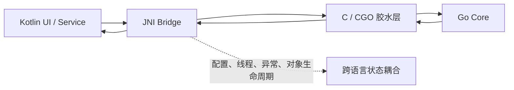
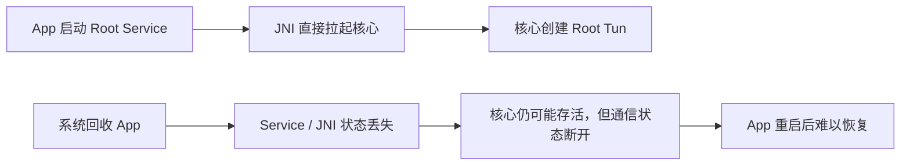
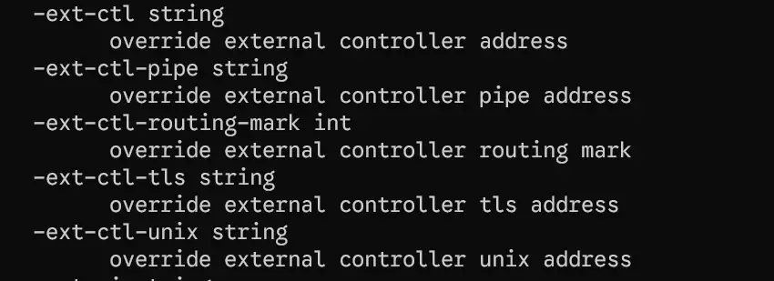
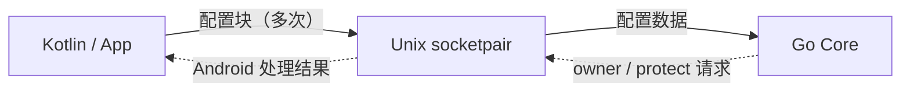

<Frame>
  
</Frame>

**_每一次探索的起点，往往都是一个「为什么」_**

## 前情提要

接下来的内容与上一篇文章有关联，部分内容上一篇已经提到，这里不再赘述

<Card title="让 APK 轻一点" icon="link" horizontal href="../apk-shrink">
</Card>

# 为什么要换一种方式

在 YumeBox 开发初期，Core 部分代码并未独立实现，而是直接复用了 ClashMetaForAndroid 的 [Core JNI 实现](https://github.com/MetaCubeX/ClashMetaForAndroid/tree/main/core/src)。毕竟本着“**_少造轮子_**”的原则，直接复用成熟代码是开发初期较为平稳的做法

<GitHub.Repo repo="YumeYucca/YumeBox" />

从实际运行效果来看，这套 JNI Bridge 表现确实相当稳定；加之上游内核并未提供 Android Gomobile 绑定，CMFA Core 的 FFI 方案可以说是最佳实践

但在桌面端和 Web 面板间的通信，则是选择另一种方式 [REST API](https://wiki.metacubex.one/api/)，由内核提供的 API

<Card title="API 请求示例" icon="link" horizontal href="https://wiki.metacubex.one/api/">
</Card>

## 换一种实现方式

ClashMetaForAndroid 的这套 JNI Bridge 的 FFI 方案，虽然确实稳定可用，但在不断的迭代中，手写 JNI 的**维护成本与链路复杂度**逐渐显现出来



Core 部分的代码占比并不小，同时存在 Cgo 和 C 以及 JNI，但是耦合太重，如果要增加一些新的 feature 时，就要同时改动 `CGO`  `C/JNI` 和 `kotlin` 部分，太过繁琐


<Frame>
  
</Frame>

## Root 权限下 Tun 的运行

在 Android 设备上，Mihomo 运行由 App 建立 VPN service 路由流量，受限于 Root 权限的缺失，并不是 Native Tun 的实现

成熟的 Root 方案例如 KernelSU Magisk 等，且用户群体也不少，但是大多数都在使用 Magisk 模块的透明代理。于是开箱即用的 Tun 实现成为了目标的 feature 之一

但问题出现各个层面，起初的解决方案是，是由 Libsu 直接创建 Root service，补齐 JNI 侧的传参即可，但新的问题接踵而至，在设计中，由 Root 权限创建的进程或者 service 应该不跟随 App 的生命周期，换句话说就是，当 APP 被系统或者主动 kill 掉时，仍在代理流量

由 `su` 拉起的 Root 核心，本质上应该是一个独立的守护进程：App 被系统回收以后，核心不应该立刻停止，代理流量也不应该突然中断。可如果核心完全依赖 JNI 和绑定 Service，那么 App 重启以后，之前的进程状态、控制连接和配置都很难恢复




## 核心与壳

经过研究发现，**将 Share 换成 PIE 执行**，可以解决 Core 的复用问题，将 JNI Bridge 重写实现，做一个的壳，只需要将核心部分拉起运行即可，顺带解决了 JNI 通信状态回连，是有 Unix Socket 通信，当然，这是标准做法

<Frame>
  
</Frame>

当然，这里会出现另一个问题：如果直接将内核打包成可执行文件，就会像上一篇文章中提到的那样——在将 lib 打包并压缩，但这里已经是 PIE 可执行文件，并不是 share 共享库。这就会导致可执行权限丢失，而且另一个问题是，在安卓上，安卓 SDK 29 限制了可执行文件的运行位置：在宿主私有目录是不能直接运行可执行文件的，能运行的位置只有 APP 解压之后的 lib 目录

所以这就在打包时出现了一个问题：真正收益大小带来的主要是核心的打包，但如果核心坚持作为 PIE 可执行文件，那么后面就没有办法继续作为 load 共享库。最后确定的方向是：核心仍然编译成共享库，但不再让 Kotlin 直接加载并调用大量 Go 导出函数。新增一个很小的 PIE 启动壳，由它负责 `dlopen` 真正的 `libmihomocore.so`，再调用唯一的 `MihomoMain` 入口

```c
// shell.c：启动壳只负责加载核心并转交入口

void *library = dlopen("libmihomocore.so", RTLD_NOW | RTLD_LOCAL);
int (*main_entry)(int, char **, char *) = dlsym(library, "MihomoMain");
return main_entry(argc, argv, channel);
```

```go
// entry.go：核心业务从这里开始，但不再暴露几十个 JNI 方法

//export MihomoMain
func MihomoMain(argc C.int, argv **C.char, channel *C.char) C.int {
    return C.int(runMain(readArgs(argc, argv), C.GoString(channel)))
}
```

## 进程间通信

进程独立以后，新的问题就变成了：配置怎么给核心？VPN 建立出来的 TUN FD 怎么给核心？核心建立的出站 socket 又如何请求 Android 的 `protect()`？

最后的方案没有再设计一套复杂的 JNI 协议，而是使用 Unix 原生的 `socketpair`。启动阶段创建一对 `AF_UNIX + SOCK_SEQPACKET`，一端留在 Kotlin，另一端跟随子进程进入 Go 核心

```c
int channel[2];
if (socketpair(AF_UNIX, SOCK_SEQPACKET, 0, channel) < 0) {
    /* 通信通道创建失败，核心不能继续启动 */
}
```


之所以选择 `SOCK_SEQPACKET`，是因为它保留了消息边界。配置可以分成多条消息发送，核心每次读取到的就是一条完整消息，不需要额外设计长度头，也不会出现 TCP 常见的粘包和半包问题

```kotlin
// Channel.kt：一次调用对应一条消息。
channel.writeMessage(configBytes, offset, size)
```



这条 Socket 不对外监听端口，只存在于父子进程之间。核心启动完成以后，它还会继续保留，用来处理两类 Android 才能完成的请求：查询连接属于哪个 App，以及保护核心自己的出站 socket

## Socket 保护

VPN 模式下，TUN 接收设备流量并交给核心。核心随后要连接远端代理服务器。如果这个连接也被 VPN 捕获，它又会回到 TUN，核心再次读取，最后形成一个非常典型的回环

这里不能简单地把整个 App UID 排除出 VPN，因为 App 自己的普通网络请求仍然需要经过代理。当前实现采用的是“按 socket 保护”：核心每次准备建立出站连接时，把这个 socket 的 FD 通过 `SCM_RIGHTS` 发回 App，请求 `VpnService.protect(fd)`

```go
// hooks.go：在 connect 前把核心 socket 交给 Android 处理

dialer.DefaultSocketHook = func(_, _ string, conn syscall.RawConn) error {
    var protectErr error
    conn.Control(func(fd uintptr) {
        protectErr = rpc.protect(int(fd))
    })
    return protectErr
}
```

```kotlin
// CoreProcess.kt：只保护核心传来的 socket，处理后立即关闭副本

private fun protectCoreSocket(fd: Int): String = try {
    if ((context as? VpnService)?.protect(fd) == true) "protected" else "denied"
} finally {
    ParcelFileDescriptor.adoptFd(fd).close()
}
```

## 节点预览

当然，在桌面端或者 Web 端，可以通过核心实时运行时的 API 获取当前节点列表。但如果是在 Android 端，没有一个持续运行的 Service 去把内核拉起来运行，那么节点要怎么预览呢？

如果不启动真正的核心进程，又想拿到节点列表，其实这个问题也很简单。简单来讲，就是再做一个壳。

真正启动的时候，再把这个负责启动核心的壳替换掉；而当前用于预览的壳，只负责读取配置，然后提供一个 API 用来预览节点。它并不会真正启动核心，更不会接管实际的代理流量。

## 内核切换

这里和上一篇文章有一些关联。在上一篇文章中介绍过，共享库的 `load` 加载和可执行权限并没有直接关系。也就是说，只要共享库存放在宿主目录中，就可以正常通过 `load` 加载

结合上面提到的方案，核心依然作为共享库打包，而不是直接作为 PIE 可执行文件。这样一来，只需要构建不同版本的内核源码，就可以在运行时切换内核

而壳层并不会影响核心的加载，因为不同内核的入口点都是一样的

至于内核的切换方案，基本上可以直接从云端获取。但是 Android 端受限于共享库，而不是官方提供的可执行文件，所以我们需要单独创建一个工作流，实时同步上游源码，然后构建出对应的内核

这也是后来 smart 分支不再单独构建，而是直接合并到主项目中，通过切换的方式使用的原因

<GitHub.Repo repo="YumeYucca/Kernel-Builder" />

## 总结

这一套方案从根本上来讲，并没有对内核源码打多少补丁，仅仅修改了构建时所需要的 tag 限制，再通过一些简单的壳把真正的内核拉起来

这样也就不需要像 ClashMetaForAndroid 那样手写大量 JNI 代码和 CGO 导出

从可持续维护的角度来看，这种方案的维护成本也比较低。因为真正需要维护的只是比较简单的壳，而不是直接通过 FFI 去修改内核源码

例如 FlClash 的内核并不是直接实时同步上游源码进行构建，而是在 fork 源码之后，再 Patch 到源码中创建 FFI 接口

当然，在大多数情况下，我们并不希望对上游源码进行过多修改

所以这套方案总结下来，真正修改的部分其实只有构建限制 tag。换句话说，在尽可能不修改上游源码的情况下，实现了完整的 Root 内核进程、TUN 以及内核切换

## 自定义图标扩展

<GitHub.Repo repo="YumeYucca/YumeBox-IconKit" />

这里用到的方法也比较简单：

1. 在文档页面创建一个组件，实时裁切用户上传的图标
2. 将裁切后的图标中转上传到 Cloudflare S3，作为临时存储，并返回一个链接
3. 前端指向构建仓库中的一个 Issue，并创建对应的 Issue 模板
4. 用户原样填写这个模板，然后触发 GitHub Action

方案的优点是：不需要更换签名，也不需要修改其他内容
