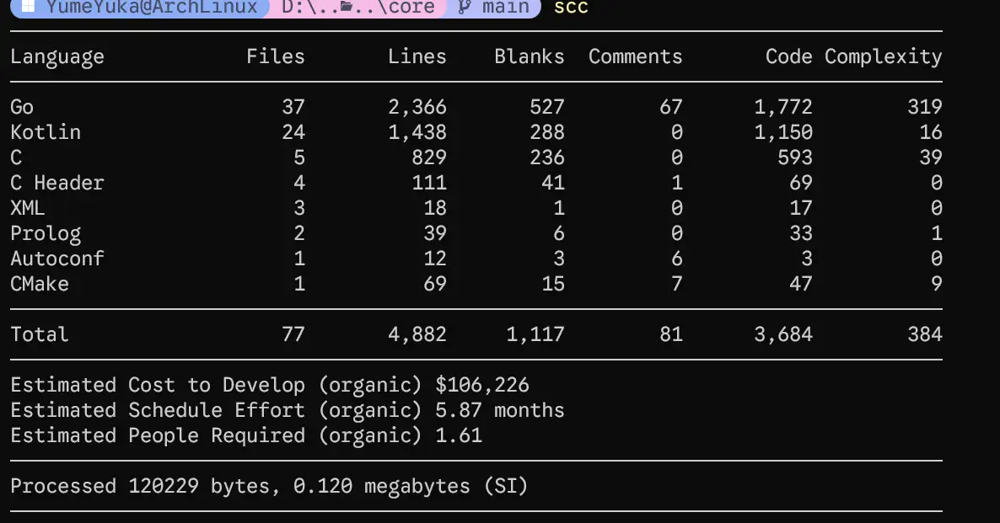

<Frame>
  
</Frame>

***每一次探索的起点，往往都是一个「为什么」***

## 前情提要

接下里的内容和上一篇文章有关联，其中有些内容已经提到过了

<Card title="让 APK 轻一点" icon="link" href="../apk-shrink" horizontal></Card>

# 情景导入

由于某些原因，YumeBox 的 Core 起初并未独立实现，而是复用了 ClashMetaForAndroid 的 [Core JNI 实现](https://github.com/MetaCubeX/ClashMetaForAndroid/tree/main/core/src)，秉持着能少造轮子就少写的原则，这一部分也就保留下来了

在逐步的迭代中发现，`JNI Bridge` 正常是有是没有太大问题的，而且 Mihome 也并未 Android 提供 `Go Mobile` 这样的实现，综合看起来 **ClashMetaForAndroid** 的 JNI 相当于是最佳实践

在桌面端和 Web 面板间的通信选择是另一种方式 [REST API](https://wiki.metacubex.one/api/)

<Card title="API 请求示例" icon="link" href="https://wiki.metacubex.one/api/" horizontal></Card>

## 计划

在 ClashMetaForAndroid 中 Core 部分的 JNI 占比并不小，同时存在 Cgo 和 C 以及手写的 JNI 这些内容，~~手写 JNI 还是太权威了~~ ，但是耦合太重，如果要增加一些新的 feature 时，就要同时改动 Cgo C JNI 和 kotlin 部分，太过繁琐

<Frame>
  
</Frame>

为什么不选择重写，而是使用 [REST API](https://wiki.metacubex.one/api/) 来通信，性能开销几乎忽略不计，并非性能密集操作，开销完全可以忽略，对于 内核部分，只需要把 Core 拉起来即可，剩下的交给 [REST API](https://wiki.metacubex.one/api/) 来处理，这看起来似乎是一个不错的选择

