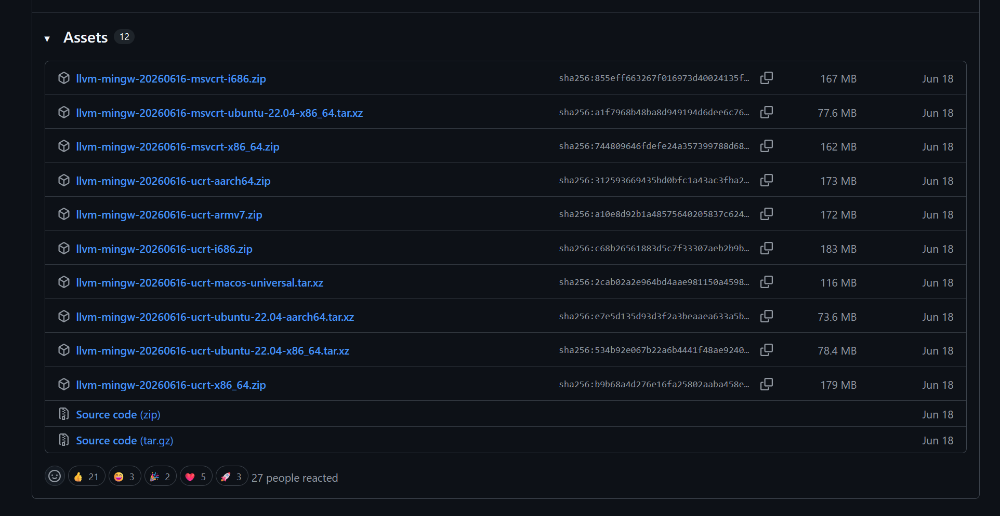
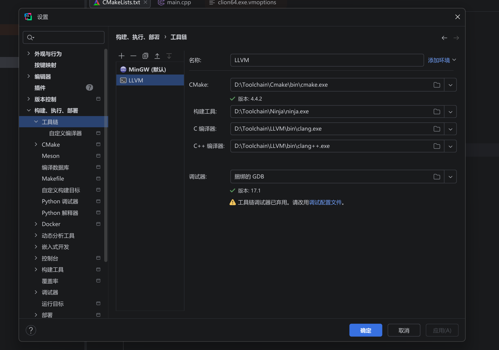
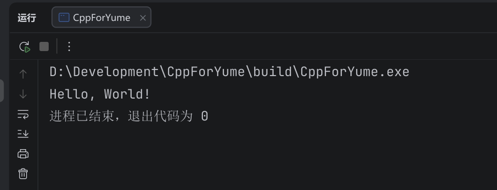

<Frame>
  
</Frame>

***配置工具链也是一门学问***

# 开发工具选择

<Info>
  工欲善其事，必先利其器
</Info>

- [Visual Studio Code](https://www.bing.com/ck/a?!&&p=ba3366210734759ca6c2ff0d8e4d6f20c38c25a26de1a59524eef47831e1732aJmltdHM9MTc4NzcwMjQwMA&ptn=3&ver=2&hsh=4&fclid=3a0b8182-881b-6bf4-0357-963f89946ab0&u=a1aHR0cHM6Ly9jb2RlLnZpc3VhbHN0dWRpby5jb20v&ntb=1)
- [CLion](https://www.jetbrains.com/clion/)
- [Visual Studio IDE](https://visualstudio.microsoft.com/zh-hans/vs/)

我比较喜欢 Jetbrains 家的 IDE，选择 CLion 作为开发工具，可能是 IDEA 的原因，Jetbrains 家的 IDE 上手都比较快

# 工具链选择

<GitHub.Repo repo="mstorsjo/llvm-mingw" />

当然是选择 LLVM MinGW 啦

<Frame>
  
</Frame>

一般选择 [llvm-mingw-20260616-ucrt-x86\_](https://github.com/mstorsjo/llvm-mingw/releases/download/20260616/llvm-mingw-20260616-ucrt-x86_64.zip)[64.zip](http://64.zip) ，下载 release 然后解压工具链存放问题，然后添加 Path 到环境变量

<Frame>
  
</Frame>

然后 CLion 配置工具链这样，直接添加即可，然后在 Cmake 工具链处添加选择的工具链，例如 LLVM

然后随便创建一个新的项目，写点代码看看

```cpp
#include <cstdio>

auto main() -> int {
    printf("Hello, World!");
    return 0;
}
```

<Frame>
  
</Frame>

# 关于格式化

`.clang-format` 的一些自用配置

```yaml .clang-format expandable
---
BasedOnStyle: LLVM
Language: Cpp
Standard: Latest
ColumnLimit: 106
IndentWidth: 4
TabWidth: 4
ConstructorInitializerIndentWidth: 4
ContinuationIndentWidth: 4
LineEnding: LF
UseCRLF: false
UseTab: Never
InsertNewlineAtEOF: false
AccessModifierOffset: -4
AlignAfterOpenBracket: Align
AlignArrayOfStructures: Right
AlignConsecutiveAssignments: Consecutive
AlignConsecutiveBitFields: Consecutive
AlignConsecutiveDeclarations: Consecutive
AlignConsecutiveMacros: Consecutive
AlignConsecutiveShortCaseStatements:
  Enabled: true
  AcrossEmptyLines: false
  AcrossComments: false
  AlignCaseArrows: true
  AlignCaseColons: true
AlignEscapedNewlines: Left
AlignOperands: AlignAfterOperator
AlignTrailingComments: true
AllowAllArgumentsOnNextLine: true
AllowAllParametersOfDeclarationOnNextLine: true
AllowBreakBeforeNoexceptSpecifier: Always
AllowShortBlocksOnASingleLine: Always
AllowShortCaseExpressionOnASingleLine: true
AllowShortCaseLabelsOnASingleLine: true
AllowShortCompoundRequirementOnASingleLine: true
AllowShortEnumsOnASingleLine: true
AllowShortFunctionsOnASingleLine: All
AllowShortIfStatementsOnASingleLine: AllIfsAndElse
AllowShortLambdasOnASingleLine: All
AllowShortLoopsOnASingleLine: true
AlwaysBreakAfterDefinitionReturnType: None
AlwaysBreakAfterReturnType: None
AlwaysBreakBeforeMultilineStrings: false
AlwaysBreakTemplateDeclarations: Yes
BinPackArguments: true
BinPackParameters: true
BitFieldColonSpacing: After
BraceWrapping:
  AfterCaseLabel: false
  AfterClass: false
  AfterControlStatement: Never
  AfterEnum: false
  AfterExternBlock: false
  AfterFunction: false
  AfterNamespace: false
  AfterStruct: false
  AfterUnion: false
  BeforeCatch: false
  BeforeElse: false
  BeforeLambdaBody: false
  BeforeWhile: false
  IndentBraces: false
  SplitEmptyFunction: true
  SplitEmptyRecord: true
  SplitEmptyNamespace: true
BreakAdjacentStringLiterals: false
BreakAfterAttributes: Leave
BreakAfterReturnType: None
BreakArrays: true
BreakBeforeBinaryOperators: NonAssignment
BreakBeforeBraces: Attach
BreakBeforeConceptDeclarations: false
BreakBeforeInlineASMColon: OnlyMultiline
BreakBeforeTernaryOperators: true
BreakBinaryOperations: Never
BreakConstructorInitializers: AfterColon
BreakFunctionDefinitionParameters: false
BreakInheritanceList: AfterColon
BreakStringLiterals: false
BreakTemplateDeclarations: true
CompactNamespaces: false
Cpp11BracedListStyle: true
DerivePointerAlignment: false
DisableFormat: false
EmptyLineAfterAccessModifier: Never
EmptyLineBeforeAccessModifier: LogicalBlock
FixNamespaceComments: false
IncludeBlocks: Regroup
IncludeCategories:
  - Regex: '^<.*/.*\.h>$'
    Priority: 4
    SortPriority: 0
    CaseSensitive: false
  - Regex: '^<.*\.h>'
    Priority: 3
    SortPriority: 0
    CaseSensitive: false
  - Regex: '^<.*/.*'
    Priority: 2
    SortPriority: 0
    CaseSensitive: false
  - Regex: '^<.*'
    Priority: 1
    SortPriority: 0
    CaseSensitive: false
  - Regex: '.*'
    Priority: 5
    SortPriority: 0
    CaseSensitive: false
IndentAccessModifiers: false
IndentCaseBlocks: false
IndentCaseLabels: true
IndentExternBlock: NoIndent
IndentGotoLabels: true
IndentPPDirectives: BeforeHash
IndentRequiresClause: false
IndentWrappedFunctionNames: true
InsertBraces: false
InsertTrailingCommas: None
IntegerLiteralSeparator:
  Binary: 0
  BinaryMinDigits: 0
  Decimal: 0
  DecimalMinDigits: 0
  Hex: 0
  HexMinDigits: 0
KeepEmptyLines:
  AtEndOfFile: false
  AtStartOfBlock: false
  AtStartOfFile: false
LambdaBodyIndentation: OuterScope
MaxEmptyLinesToKeep: 1
NamespaceIndentation: All
PackConstructorInitializers: NextLine
PointerAlignment: Left
PPIndentWidth: -1
QualifierAlignment: Custom
QualifierOrder:
  - type
  - static
  - friend
  - constexpr
  - const
  - volatile
  - inline
  - restrict
ReferenceAlignment: Pointer
ReflowComments: true
RemoveBracesLLVM: true
RemoveParentheses: ReturnStatement
RemoveSemicolon: true
RequiresClausePosition: SingleLine
RequiresExpressionIndentation: OuterScope
SeparateDefinitionBlocks: Leave
ShortNamespaceLines: 0
SkipMacroDefinitionBody: false
SortIncludes: CaseSensitive
SortUsingDeclarations: true
SpaceAfterCStyleCast: false
SpaceAfterLogicalNot: false
SpaceAfterTemplateKeyword: false
SpaceAroundPointerQualifiers: Default
SpaceBeforeAssignmentOperators: true
SpaceBeforeCaseColon: false
SpaceBeforeCpp11BracedList: false
SpaceBeforeCtorInitializerColon: false
SpaceBeforeInheritanceColon: true
SpaceBeforeJsonColon: false
SpaceBeforeParens: ControlStatements
SpaceBeforeRangeBasedForLoopColon: true
SpaceBeforeSquareBrackets: false
SpaceInEmptyBlock: false
SpaceInEmptyParentheses: false
SpacesBeforeTrailingComments: 1
SpacesInAngles: Never
SpacesInCStyleCastParentheses: false
SpacesInConditionalStatement: false
SpacesInContainerLiterals: false
SpacesInLineCommentPrefix:
  Minimum: 1
  Maximum: -1
SpacesInParentheses: false
SpacesInSquareBrackets: false
VerilogBreakBetweenInstancePorts: true
```