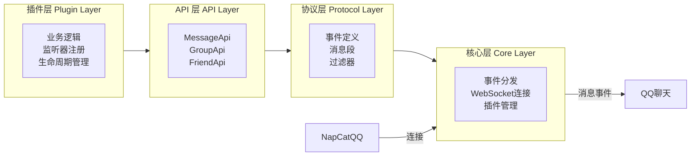

YumeBot 是一个基于 NapCatQQ 的 QQ 机器人框架。

## 核心概念

### 插件系统

每个功能都是一个插件：

```kotlin
class MyPlugin : PluginPackage() {
    override val id = "com.example.myplugin"
    override val name = "我的插件"
    override val version = "1.0.0"
    
    override suspend fun onBotContextReady() {
        // 插件初始化逻辑
    }
}
```

### 事件监听器

处理 QQ 事件的核心机制：

```kotlin
pluginContext.onGroupMessage(
    filter = Filters.groupKeyword("关键词")
) { event ->
    // 处理群消息事件
}
```

### 过滤器系统

精确匹配事件：

```kotlin
// 关键词过滤
Filters.groupKeyword("你好", "hello")

// 前缀过滤
Filters.groupStartsWith("/cmd")

// 组合过滤
Filters.and(
    Filters.groupKeyword("搜索"),
    Filters.fromGroup(123456789)
)
```

### 消息构建器

DSL 风格的消息构建：

```kotlin
val message = message {
    text("Hello ")
    at(userId)
    image("https://example.com/image.jpg")
}.build()
```

## 架构




## 下一步

<CardGroup cols={2}>
  <Card title="快速开始" icon="rocket" href="/guide/quick-start">
    快速部署和使用 YumeBot
  </Card>
  <Card title="插件市场" icon="store" href="/guide/plugin-marketplace">
    查看可用插件
  </Card>
</CardGroup>