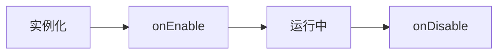

<Note>
  YumeBot 使用现代化的**注解式API**，让插件开发更简洁、更优雅。
</Note>

## 创建插件

每个插件必须继承 `Plugin` 类：

```kotlin
package plugins.example

import plus.yumeyuka.yumebot.plugin.Plugin
import plus.yumeyuka.yumebot.plugin.annotations.*
import plus.yumeyuka.yumebot.protocol.message.OB11GroupMessage
import plus.yumeyuka.yumebot.api.message.message

class MyPlugin : Plugin() {
    override val id = "com.example.myplugin"
    override val name = "我的插件"
    override val version = "1.0.0"
    override val author = "作者名"
    override val description = "插件描述"
    
    override suspend fun onEnable() {
        logger.info("插件已启动")
    }
    
    override suspend fun onDisable() {
        logger.info("插件已卸载")
    }
    
    @OnGroupMessage
    @GroupKeyword("你好")
    @Priority(100)
    suspend fun onHello(event: OB11GroupMessage) {
        val reply = message {
            at(event.sender.userId)
            text(" 你好！")
        }.build()
        
        messageApi?.sendGroupMessage(event.groupId, reply, name)
    }
}
```

## 插件元数据

<ParamField path="id" type="String" required>
  插件唯一标识符，**必须使用反向域名格式**（如：com.example.plugin）
</ParamField>

<ParamField path="name" type="String" required>
  插件显示名称
</ParamField>

<ParamField path="version" type="String" required>
  插件版本号，格式：`x.y.z`
</ParamField>

<ParamField path="author" type="String" required>
  作者信息
</ParamField>

<ParamField path="description" type="String" required>
  功能描述
</ParamField>

## 生命周期



### onEnable()

插件启动时调用，用于初始化资源、加载配置等。

```kotlin
override suspend fun onEnable() {
    logger.info("${name} 已启动")
    // 初始化配置
    config = loadConfig()
    // 启动定时任务
    startScheduledTasks()
}
```

### onDisable()

插件卸载时调用，用于清理资源、保存数据等。

```kotlin
override suspend fun onDisable() {
    logger.info("${name} 已卸载")
    // 保存数据
    saveData()
    // 取消协程
    coroutineScope.cancel()
}
```

## 注解式监听器

YumeBot 使用**注解**自动注册监听器，无需手动调用注册方法。

### 群消息监听器

```kotlin
@OnGroupMessage
@GroupKeyword("搜索")
@Priority(100)
suspend fun onSearch(event: OB11GroupMessage) {
    val query = event.rawMessage.removePrefix("搜索").trim()
    // 处理搜索
}
```

<ParamField path="@OnGroupMessage" type="Annotation" required>
  标记为群消息监听器
</ParamField>

<ParamField path="@GroupKeyword" type="Annotation">
  关键词过滤器，支持多个关键词
</ParamField>

<ParamField path="@Priority" type="Annotation">
  优先级，数字越大越先执行（默认：0）
</ParamField>

### 私聊消息监听器

```kotlin
@OnPrivateMessage
@PrivateKeyword("帮助")
@Priority(100)
suspend fun onHelp(event: OB11PrivateMessage) {
    val help = message {
        text("可用命令：\n")
        text("- 帮助\n")
        text("- 状态")
    }.build()
    
    messageApi?.sendPrivateMessage(event.userId, help, name)
}
```

### 通知事件监听器

```kotlin
@OnNotice
@Priority(100)
suspend fun onNotice(event: NoticeEvent) {
    when (event) {
        is GroupIncreaseNotice -> {
            // 新成员加群
            val welcome = message {
                at(event.userId)
                text(" 欢迎加入！")
            }.build()
            messageApi?.sendGroupMessage(event.groupId, welcome, name)
        }
        is GroupDecreaseNotice -> {
            // 成员退群
            logger.info("用户 ${event.userId} 离开了群 ${event.groupId}")
        }
    }
}
```

### 请求事件监听器

```kotlin
@OnRequest
@Priority(100)
suspend fun onRequest(event: RequestEvent) {
    when (event) {
        is FriendRequest -> {
            // 自动同意好友请求
            friendApi?.setFriendAddRequest(event.flag, approve = true)
            logger.info("已同意好友请求：${event.userId}")
        }
        is GroupRequest -> {
            // 处理加群请求
            if (event.subType == GroupRequestSubType.INVITE) {
                groupApi?.setGroupAddRequest(event.flag, approve = true)
            }
        }
    }
}
```

### 元事件监听器

```kotlin
@OnMeta
@Priority(100)
suspend fun onMeta(event: MetaEvent) {
    when (event) {
        is OB11HeartbeatEvent -> {
            // 心跳事件
            logger.debug("心跳：${event.status.online}")
        }
        is OB11LifeCycleEvent -> {
            // 生命周期事件
            logger.info("生命周期：${event.subType}")
        }
    }
}
```

## 过滤器注解

### 群消息过滤器

```kotlin
// 关键词过滤（任一匹配）
@GroupKeyword("你好", "hello", "hi")

// 精确匹配
@GroupExact("ping", ignoreCase = true)

// 前缀匹配
@GroupStartsWith("/cmd")

// 正则表达式
@GroupRegex("^/\\w+\\s+.*")

// 指定群
@FromGroup(123456789, 987654321)

// 指定用户
@FromUserInGroup(111111111, 222222222)
```

### 私聊过滤器

```kotlin
// 关键词过滤
@PrivateKeyword("帮助", "help")

// 精确匹配
@PrivateExact("status")

// 前缀匹配
@PrivateStartsWith("/")

// 正则表达式
@PrivateRegex("^\\d+$")

// 指定用户
@FromUser(123456789)
```

### 组合过滤器

```kotlin
// 默认为 AND 逻辑（所有条件都满足）
@OnGroupMessage
@GroupKeyword("搜索")
@FromGroup(123456789)
suspend fun onSearch(event: OB11GroupMessage) {
    // 只在指定群且包含"搜索"关键词时触发
}

// 使用 OR 逻辑（任一条件满足）
@OnGroupMessage
@GroupKeyword("查询", "搜索")
@FilterMode(FilterCombineMode.OR)
suspend fun onQuery(event: OB11GroupMessage) {
    // "查询"或"搜索"都会触发
}
```

## 消息构建

### 基础消息段

```kotlin
val message = message {
    // 文本
    text("普通文本")
    
    // @某人
    at(userId)
    
    // @全体成员
    atAll()
    
    // QQ表情
    face(74)  // 表情ID
    
    // 图片
    image(url = "https://example.com/image.jpg")
    image(file = "file:///path/to/image.jpg")
    
    // 语音
    record(file = "file:///path/to/audio.mp3")
    
    // 视频
    video(file = "file:///path/to/video.mp4")
    
    // 回复消息
    reply(messageId)
}.build()
```

### 复杂消息示例

```kotlin
// 卡片式消息
val card = message {
    text("━━━ 查询结果 ━━━\n")
    text("标题：示例标题\n")
    text("描述：这是描述内容\n")
    image("https://example.com/image.jpg")
    text("\n━━━━━━━━━━━━")
}.build()

// 艾特多人
val notification = message {
    text("重要通知：\n")
    at(111111111)
    text(" ")
    at(222222222)
    text(" ")
    at(333333333)
    text("\n请注意查看")
}.build()

// 引用回复
val reply = message {
    reply(event.messageId)  // 引用原消息
    text("收到！")
}.build()
```

## 访问 API

插件可以通过注入的 API 对象与 QQ 交互。

### 消息 API

```kotlin
// 发送群消息
messageApi?.sendGroupMessage(groupId, message, name)

// 发送私聊消息
messageApi?.sendPrivateMessage(userId, message, name)

// 撤回消息
messageApi?.deleteMessage(messageId)

// 获取消息
val msg = messageApi?.getMessage(messageId)

// 标记已读
messageApi?.markMsgAsRead(messageId)
```

### 群组 API

```kotlin
// 踢出群成员
groupApi?.setGroupKick(groupId, userId, rejectAddRequest = false)

// 禁言
groupApi?.setGroupBan(groupId, userId, duration = 600)

// 全员禁言
groupApi?.setGroupWholeBan(groupId, enable = true)

// 设置管理员
groupApi?.setGroupAdmin(groupId, userId, enable = true)

// 设置群名片
groupApi?.setGroupCard(groupId, userId, card = "新名片")

// 退出群聊
groupApi?.setGroupLeave(groupId, isDismiss = false)
```

### 好友 API

```kotlin
// 发送点赞
friendApi?.sendLike(userId, times = 10)

// 处理好友请求
friendApi?.setFriendAddRequest(flag, approve = true, remark = "备注")

// 删除好友
friendApi?.deleteFriend(userId)
```

<Warning>
  所有 API 对象都是可空的（`messageApi?`），使用前建议使用安全调用操作符 `?.`
</Warning>

## 数据持久化

### 使用 JSON 配置

```kotlin
import kotlinx.serialization.Serializable
import kotlinx.serialization.json.Json
import java.io.File

@Serializable
data class PluginConfig(
    val enabled: Boolean = true,
    val welcomeMessage: String = "欢迎！",
    val allowedGroups: List<Long> = emptyList()
)

class MyPlugin : Plugin() {
    private lateinit var config: PluginConfig
    private val configFile = File("plugins/${id}/config.json")
    private val json = Json {
        prettyPrint = true
        ignoreUnknownKeys = true
    }
    
    override suspend fun onEnable() {
        config = loadConfig()
        logger.info("配置已加载")
    }
    
    private fun loadConfig(): PluginConfig {
        return if (configFile.exists()) {
            json.decodeFromString(configFile.readText())
        } else {
            PluginConfig().also { saveConfig(it) }
        }
    }
    
    private fun saveConfig(config: PluginConfig) {
        configFile.parentFile.mkdirs()
        configFile.writeText(json.encodeToString(PluginConfig.serializer(), config))
    }
}
```

### 使用数据库

```kotlin
// 使用 SQLite (添加依赖: org.xerial:sqlite-jdbc)
import java.sql.Connection
import java.sql.DriverManager

class DatabasePlugin : Plugin() {
    private lateinit var connection: Connection
    
    override suspend fun onEnable() {
        connection = DriverManager.getConnection("jdbc:sqlite:plugins/${id}/data.db")
        createTables()
    }
    
    override suspend fun onDisable() {
        connection.close()
    }
    
    private fun createTables() {
        connection.createStatement().execute("""
            CREATE TABLE IF NOT EXISTS users (
                id INTEGER PRIMARY KEY,
                qq_id INTEGER NOT NULL,
                points INTEGER DEFAULT 0
            )
        """)
    }
    
    fun addPoints(userId: Long, points: Int) {
        connection.prepareStatement("""
            INSERT INTO users (qq_id, points) VALUES (?, ?)
            ON CONFLICT(qq_id) DO UPDATE SET points = points + ?
        """).use { stmt ->
            stmt.setLong(1, userId)
            stmt.setInt(2, points)
            stmt.setInt(3, points)
            stmt.executeUpdate()
        }
    }
}
```

## 定时任务

```kotlin
import kotlinx.coroutines.*
import kotlin.time.Duration.Companion.hours
import kotlin.time.Duration.Companion.minutes

class ScheduledPlugin : Plugin() {
    private val scope = CoroutineScope(Dispatchers.Default + SupervisorJob())
    
    override suspend fun onEnable() {
        // 延迟执行（5秒后）
        scope.launch {
            delay(5000)
            sendNotification()
        }
        
        // 定时任务（每小时执行）
        scope.launch {
            while (isActive) {
                performHourlyTask()
                delay(1.hours)
            }
        }
        
        // 每天指定时间执行
        scope.launch {
            while (isActive) {
                val now = System.currentTimeMillis()
                val nextRun = calculateNextRun(hour = 9, minute = 0)
                delay(nextRun - now)
                performDailyTask()
            }
        }
    }
    
    override suspend fun onDisable() {
        scope.cancel()
    }
    
    private fun calculateNextRun(hour: Int, minute: Int): Long {
        val calendar = java.util.Calendar.getInstance().apply {
            set(java.util.Calendar.HOUR_OF_DAY, hour)
            set(java.util.Calendar.MINUTE, minute)
            set(java.util.Calendar.SECOND, 0)
            if (timeInMillis <= System.currentTimeMillis()) {
                add(java.util.Calendar.DAY_OF_MONTH, 1)
            }
        }
        return calendar.timeInMillis
    }
}
```

## 错误处理

```kotlin
@OnGroupMessage
@GroupKeyword("查询")
suspend fun onQuery(event: OB11GroupMessage) {
    try {
        val result = performQuery(event.rawMessage)
        val reply = message {
            text("查询成功：$result")
        }.build()
        messageApi?.sendGroupMessage(event.groupId, reply, name)
    } catch (e: Exception) {
        logger.error("查询失败", e)
        val error = message {
            text("查询失败：${e.message}")
        }.build()
        messageApi?.sendGroupMessage(event.groupId, error, name)
    }
}

// 使用 runCatching
@OnGroupMessage
suspend fun onSafeQuery(event: OB11GroupMessage) {
    runCatching {
        performQuery(event.rawMessage)
    }.onSuccess { result ->
        logger.info("查询成功: $result")
    }.onFailure { error ->
        logger.error("查询失败: ${error.message}", error)
    }
}
```

## 日志记录

每个插件都有内置的 `logger` 对象：

```kotlin
class MyPlugin : Plugin() {
    override suspend fun onEnable() {
        logger.info("普通信息")
        logger.debug("调试信息")
        logger.warn("警告信息")
        logger.error("错误信息", exception)
    }
}
```

## 完整示例：签到插件

```kotlin
package plugins.checkin

import plus.yumeyuka.yumebot.plugin.Plugin
import plus.yumeyuka.yumebot.plugin.annotations.*
import plus.yumeyuka.yumebot.protocol.message.OB11GroupMessage
import plus.yumeyuka.yumebot.api.message.message
import kotlinx.serialization.Serializable
import kotlinx.serialization.json.Json
import java.io.File

@Serializable
data class CheckInData(
    val records: MutableMap<Long, CheckInRecord> = mutableMapOf()
)

@Serializable
data class CheckInRecord(
    var points: Int = 0,
    var lastCheckIn: Long = 0
)

class CheckInPlugin : Plugin() {
    override val id = "com.yumebot.checkin"
    override val name = "签到插件"
    override val version = "1.0.0"
    override val author = "YumeBot"
    override val description = "每日签到获取积分"
    
    private val dataFile = File("plugins/${id}/data.json")
    private lateinit var data: CheckInData
    private val json = Json {
        prettyPrint = true
        ignoreUnknownKeys = true
    }
    
    override suspend fun onEnable() {
        data = loadData()
        logger.info("签到插件已启动，共 ${data.records.size} 条记录")
    }
    
    override suspend fun onDisable() {
        saveData()
        logger.info("签到插件已停止")
    }
    
    @OnGroupMessage
    @GroupKeyword("签到")
    @Priority(100)
    suspend fun onCheckIn(event: OB11GroupMessage) {
        val userId = event.sender.userId
        val record = data.records.getOrPut(userId) { CheckInRecord() }
        
        val today = System.currentTimeMillis() / (24 * 60 * 60 * 1000)
        val lastDay = record.lastCheckIn / (24 * 60 * 60 * 1000)
        
        if (today == lastDay) {
            val reply = message {
                at(userId)
                text(" 你今天已经签到过了！\n当前积分：${record.points}")
            }.build()
            messageApi?.sendGroupMessage(event.groupId, reply, name)
            return
        }
        
        val bonus = (10..50).random()
        record.points += bonus
        record.lastCheckIn = System.currentTimeMillis()
        saveData()
        
        val reply = message {
            at(userId)
            text(" 签到成功！\n")
            text("获得积分：+$bonus\n")
            text("当前积分：${record.points}")
        }.build()
        
        messageApi?.sendGroupMessage(event.groupId, reply, name)
    }
    
    @OnGroupMessage
    @GroupKeyword("积分", "我的积分")
    @Priority(100)
    suspend fun onQueryPoints(event: OB11GroupMessage) {
        val userId = event.sender.userId
        val points = data.records[userId]?.points ?: 0
        
        val reply = message {
            at(userId)
            text(" 当前积分：$points")
        }.build()
        
        messageApi?.sendGroupMessage(event.groupId, reply, name)
    }
    
    @OnGroupMessage
    @GroupKeyword("积分排行")
    @Priority(100)
    suspend fun onRanking(event: OB11GroupMessage) {
        val top10 = data.records.entries
            .sortedByDescending { it.value.points }
            .take(10)
        
        val ranking = buildString {
            append("━━━ 积分排行榜 ━━━\n")
            top10.forEachIndexed { index, entry ->
                append("${index + 1}. ${entry.key}: ${entry.value.points}分\n")
            }
            append("━━━━━━━━━━━━━━")
        }
        
        val reply = message {
            text(ranking)
        }.build()
        
        messageApi?.sendGroupMessage(event.groupId, reply, name)
    }
    
    private fun loadData(): CheckInData {
        return if (dataFile.exists()) {
            json.decodeFromString(dataFile.readText())
        } else {
            CheckInData()
        }
    }
    
    private fun saveData() {
        dataFile.parentFile.mkdirs()
        dataFile.writeText(json.encodeToString(CheckInData.serializer(), data))
    }
}
```

## 最佳实践

<AccordionGroup>
  <Accordion title="使用注解简化代码" icon="at">
    使用注解式监听器，代码更简洁、更易维护
  </Accordion>
  
  <Accordion title="合理设置优先级" icon="arrow-up-1-9">
    重要监听器设置更高优先级（如：管理员命令 > 普通命令）
  </Accordion>
  
  <Accordion title="使用过滤器减少开销" icon="filter">
    精确的过滤器可以避免不必要的处理，提升性能
  </Accordion>
  
  <Accordion title="资源管理" icon="memory">
    在 `onEnable()` 初始化，在 `onDisable()` 清理
  </Accordion>
  
  <Accordion title="异步编程" icon="arrows-spin">
    使用协程处理耗时操作，避免阻塞
  </Accordion>
  
  <Accordion title="错误处理" icon="triangle-exclamation">
    捕获并记录异常，提供友好的错误提示
  </Accordion>
  
  <Accordion title="数据持久化" icon="database">
    及时保存重要数据，避免丢失
  </Accordion>
  
  <Accordion title="日志记录" icon="file-text">
    使用合适的日志级别，便于调试和监控
  </Accordion>
</AccordionGroup>

## 插件打包

### 创建插件项目

在 `plugins/` 目录下创建新模块：

```kotlin
// plugins/myplugin/build.gradle.kts
plugins {
    kotlin("jvm")
    kotlin("plugin.serialization")
}

dependencies {
    implementation(project(":api"))
    implementation(project(":protocol"))
    implementation(project(":common"))
}
```

### 配置插件工厂

```kotlin
// plugins/myplugin/src/main/resources/META-INF/services/plus.yumeyuka.yumebot.plugin.PluginFactory
package plugins.myplugin

import plus.yumeyuka.yumebot.plugin.Plugin
import plus.yumeyuka.yumebot.plugin.PluginFactory

class MyPluginFactory : PluginFactory {
    override fun createPlugin(): Plugin = MyPlugin()
}
```

### 注册到索引

```kotlin
// core/src/main/kotlin/plus/yumeyuka/yumebot/plugin/PluginRegistry.kt
object PluginRegistry {
    val pluginClasses = listOf(
        "plugins.example.ExamplePlugin",
        "plugins.myplugin.MyPlugin"  // 添加你的插件
    )
}
```

## 调试技巧

### 启用详细日志

修改 `config.json`：

```json
{
  "log": {
    "level": "DEBUG",
    "enableConsole": true
  }
}
```

### 使用断点调试

在 IDEA 中设置断点，使用 Debug 模式运行：

```bash
./gradlew run --debug-jvm
```

### 查看事件详情

```kotlin
@OnGroupMessage
suspend fun debugEvent(event: OB11GroupMessage) {
    logger.debug("收到消息: ${event.rawMessage}")
    logger.debug("发送者: ${event.sender.userId}")
    logger.debug("群号: ${event.groupId}")
    logger.debug("消息ID: ${event.messageId}")
}
```

## 常见问题

<AccordionGroup>
  <Accordion title="监听器不触发？" icon="question">
    **检查事项**：
    1. 确认注解是否正确（`@OnGroupMessage` 等）
    2. 检查过滤器是否过于严格
    3. 查看日志确认插件是否加载
    4. 确认方法签名是否正确（`suspend fun`）
  </Accordion>
  
  <Accordion title="API 调用返回 null？" icon="question">
    **原因**：WebSocket 未连接或 API 不可用
    
    **解决**：
    1. 检查 NapCatQQ 连接状态
    2. 使用安全调用 `?.`
    3. 添加 null 检查和错误处理
  </Accordion>
  
  <Accordion title="插件加载失败？" icon="question">
    **可能原因**：
    1. 元数据（id、name等）未正确设置
    2. 依赖项缺失
    3. 代码编译错误
    
    **解决**：查看启动日志中的错误信息
  </Accordion>
  
  <Accordion title="如何调试插件？" icon="question">
    1. 使用 `logger.debug()` 输出调试信息
    2. 在 IDEA 中设置断点
    3. 使用 `println()` 临时输出（记得删除）
  </Accordion>
</AccordionGroup>

## 下一步

<CardGroup cols={2}>
  <Card title="API 参考" icon="book" href="/api/listeners">
    查看完整的 API 文档
  </Card>
  <Card title="协议文档" icon="file-lines" href="/protocol/events">
    了解 NapCatQQ 事件协议
  </Card>
  <Card title="示例代码" icon="code" href="/examples/basic-examples">
    查看更多实用示例
  </Card>
  <Card title="消息 API" icon="message" href="/api/messages">
    学习消息发送和处理
  </Card>
</CardGroup>